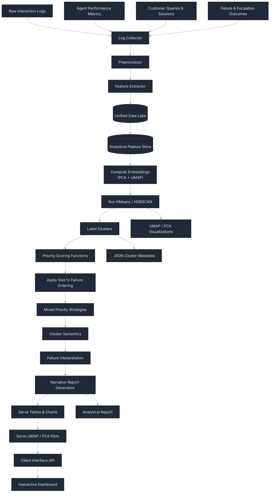

# Architectural Overview of the LLM Ops Debugging and Analytics Pipeline

## Introduction

This system constitutes a unified operational analytics pipeline for Large Language Model (LLM) deployments, integrating observability, embedding-based semantic retrieval, clustering, and agentic reasoning. The system captures user interactions, models failure behavior, and enables downstream debugging through Retrieval-Augmented Generation (RAG) and specialized LLM agents. A Streamlit dashboard provides an interactive interface for developers and operators.

The system reflects emerging design principles in LLM product infrastructure, including failure-aware embeddings, semantic clustering, and agentic specialization for domain-specific diagnostics (e.g., performance vs. failure analysis).

---

## High-Level Architecture

The architecture decomposes into four conceptual layers:

```

+--------------------------------------------------+
|  User Interface (Dashboard + Agents)             |
+--------------------------------------------------+
|  Semantic & Analytical Compute (Clustering, RAG) |
+--------------------------------------------------+
|  Storage & Vector Index (PostgreSQL + pgvector)  |
+--------------------------------------------------+
|  Data Ingestion & ETL Pipeline                   |
+--------------------------------------------------+
```





Each layer communicates through well-defined interfaces and data artifacts (CSV, Parquet, embeddings, vectors).

---

## Deployed UI Dashboard


## Data Ingestion and ETL Pipeline

### Inputs

Data Set Used:
LLM System Ops Telemetry (Synthetic)
A synthetic, production-style, multi-table LLM telemetry dataset for LLMOps analytics and decision-grade experiments.
One row = one interaction (request → response), aggregated into sessions and users, with tool usage, failures, safety flags, latency, tokens, synthetic estimated cost, and user feedback — plus a 1:1 aligned SFT table and a prompt config dimension.

URL: https://www.kaggle.com/datasets/tarekmasryo/llm-system-ops-production-telemetry-and-sft

Dataset at a glance
Time (UTC): 2025-02-01 → 2025-04-30
Core grain: 1 row = 1 LLM interaction
Designed for: monitoring, reliability, evaluation, cost control, tool-use analytics, failure RCA
Split: split is a deterministic, group-safe train/val/test assignment derived from session_id hashing (prevents session leakage)
Row counts

llm_system_interactions.csv: 9,000
llm_system_sessions_summary.csv: 1,595
llm_system_users_summary.csv: 438
llm_system_prompts_lookup.csv: 36
llm_system_instruction_tuning_samples.csv: 9,000


The pipeline ingests four structured data sources:

- llm_system_interactions.csv
- llm_system_sessions_summary.csv
- llm_system_users_summary.csv
- llm_system_prompts_lookup.csv

These correspond to canonical LLM observability signals:

Dimension | Purpose
--------- | -------
Session | Group requests
User | Attribution information
Prompt | Request semantics
Interaction | Full text + performance + failure flags

---

### Transformations

The ETL process performs:

- Column harmonization  
  - Standardizes request_text → prompt_text

- Join operations  
  - Resolves relational context across tables

- Feature engineering  
  - Latency-per-token metrics  
  - Failure classification flags  
  - Cost and tokenization normalization  

- Failure slice extraction  
  - Separates failure population for downstream statistics

- RAG embedding computation  
  - Uses Gemini embeddings (text-embedding-004)  
  - Produces 768-dimensional semantic embeddings  

- Artifact persistence  
  - Writes:
    - etl_output.csv (operational metrics)
    - rag_interactions.parquet (semantic embeddings + metadata)

These outputs form the canonical data foundation for later analysis stages.

---

## Vector Storage Layer

A PostgreSQL instance extended with pgvector serves as the vector index. The system defines:

CREATE EXTENSION IF NOT EXISTS vector;

CREATE TABLE log_embeddings (
    id SERIAL PRIMARY KEY,
    log_text TEXT NOT NULL,
    embedding VECTOR(768),
    created_at TIMESTAMP DEFAULT NOW()
);

This enables efficient similarity search via:

embedding <=> query_vector

which performs cosine or Euclidean distance retrieval depending on configuration.

This component is essential for enabling RAG over historical debugging logs, mapping user queries to semantically similar failure traces.

---

## Semantic Analytics Layer

### Clustering

The Streamlit application loads rag_interactions.parquet and computes:

- KMeans clusters (with dynamic K)
- Failure-weighted semantics
- Representative exemplar prompts per cluster

This produces a semantic taxonomy of system behaviors, useful for:

- Failure mode discovery
- UX pattern analysis
- Workload categorization

---

### Dimensionality Reduction

Visual cluster coherence is assessed using:

- Principal Component Analysis (PCA)
- UMAP manifold learning

These enable 2D embeddings suitable for operator dashboards.

UMAP is particularly effective due to its preservation of local neighborhood structure, supporting analysis of subtle failure sub-modes.

---

## LLM Debugging Agent Layer

The debugging interface uses a hybrid RAG + agentic specialization architecture.

### Retrieval

User queries are embedded via Gemini and matched against pgvector logs. Retrieved logs form contextual evidence for diagnosis.

---

### Agent Specialization

The orchestrator() directs queries to specialized agents using lightweight query classification:

Agent | Trigger domain
----- | --------------
failure_agent | crashes, exceptions
performance_agent | latency, timeouts
general_agent | fallback

This approach approximates a multi-agent tool routing scheme without requiring heavy frameworks.

---

### Response Format

The agent enforces a structured diagnostic schema:

Summary:
Causes:
Fix:
Verification:

This deviates from conversational LLM responses in favor of reproducible troubleshooting guidance.

---

## Dashboard and Observability Interface

The Streamlit UI exposes all upstream artifacts:

Visualization | Purpose
------------- | -------
Failures Over Time | Longitudinal reliability
Latency per Model | Performance analysis
Top Clusters | Semantic workload taxonomy
PCA / UMAP | Cluster structure exploration
RAG Debugging | On-demand semantic diagnosis

This satisfies core LLMOps observability goals including:

- descriptive analytics
- semantic telemetry
- clustering-based failure introspection
- direct debugging workflow support
